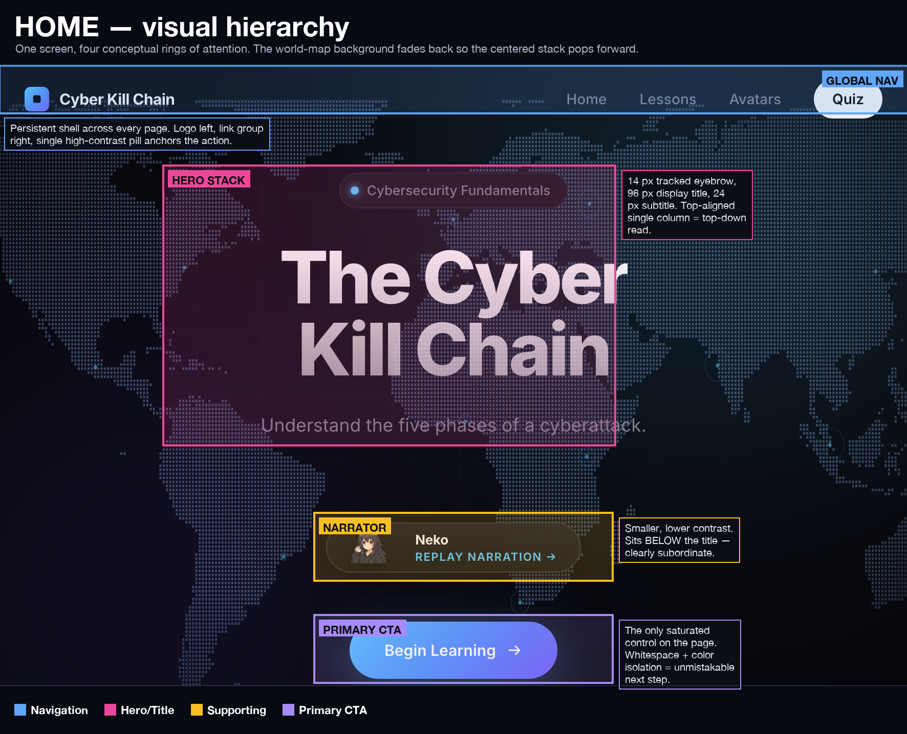
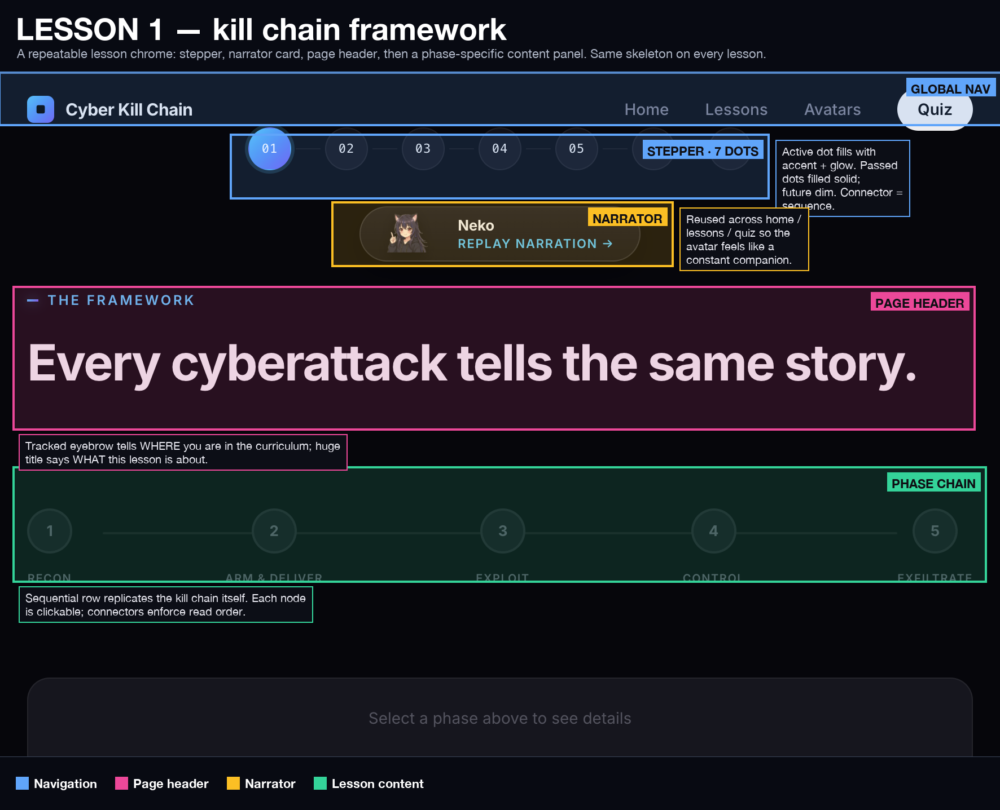
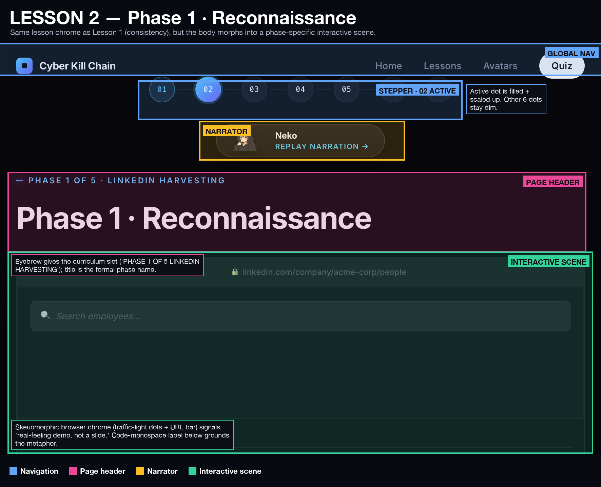
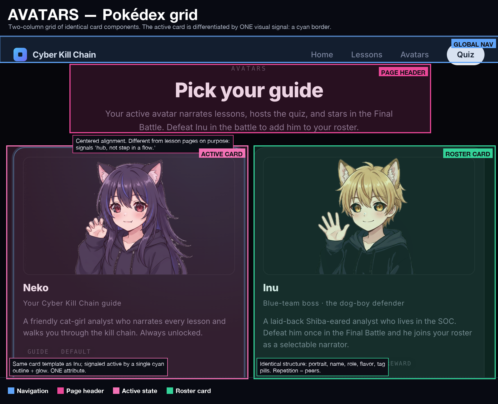
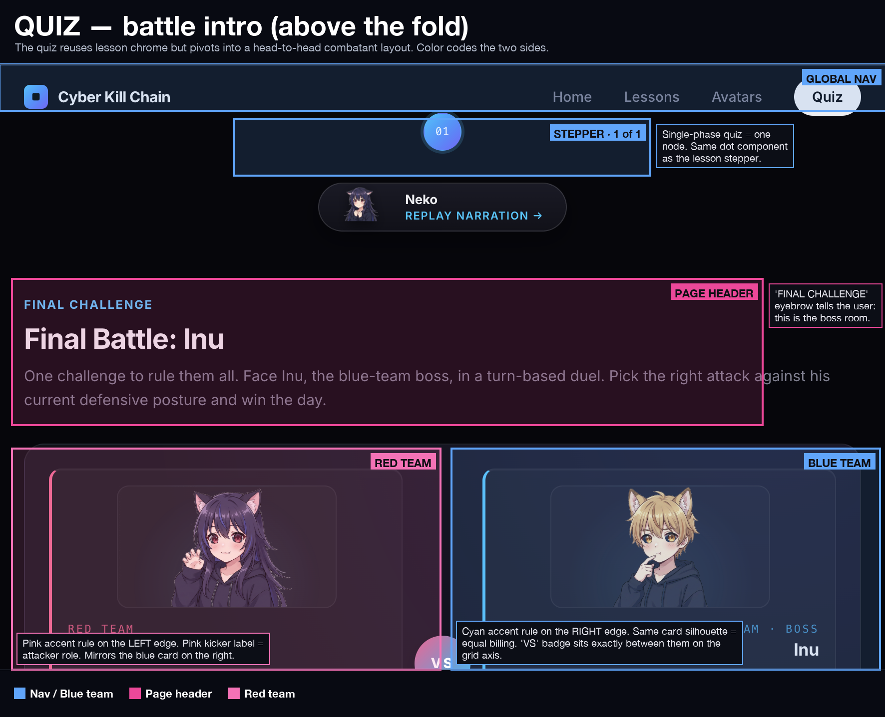
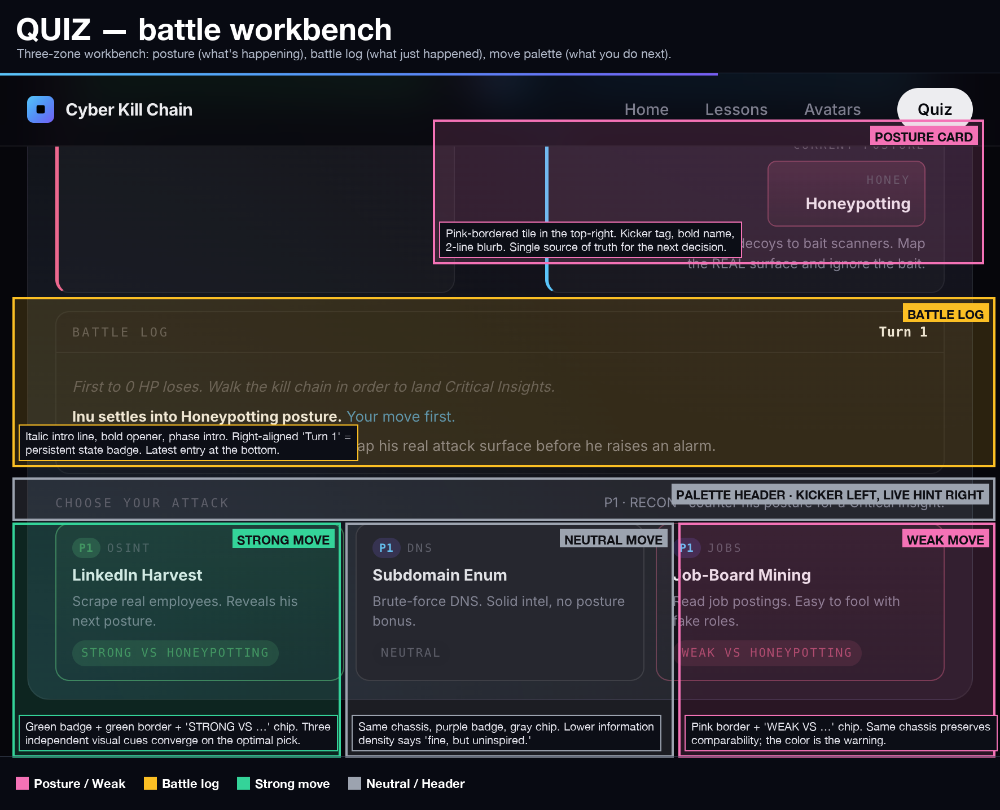
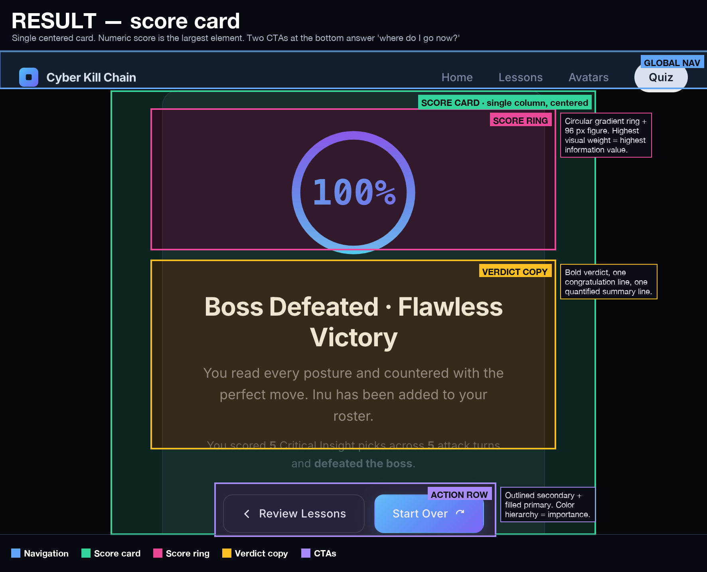

# Visual Design — Annotated Walkthrough

This document walks the seven major screens of the Cyber Kill Chain
educational module and calls out the **conceptual groups** and
**visual-hierarchy** techniques that make each screen legible at a
glance.

Every screenshot in this document is overlaid with colored rectangles.
Each rectangle isolates a *Gestalt-style group* of related UI elements
and is labeled with a short tag (e.g. `HERO STACK`, `STRONG MOVE`).
Inline captions explain the rationale.

The annotation pipeline lives at `tools/annotate_design.py`; raw
screenshots are in `design/raw/` and annotated PNGs in
`design/annotated/`.

---

## How to read the overlays

| Color  | Role |
|--------|------|
| Blue   | Navigation & wayfinding (the persistent shell) |
| Pink   | Hero / page header — the largest type on the page |
| Purple | Primary call-to-action |
| Green  | Main content blocks (lessons, cards, optimal-pick states) |
| Amber  | Supporting / narrator components |
| Pink (warm) | Accent state — active selection, posture warning, weak move |
| Grey   | Meta — utility rows, neutral states |

Boxes are drawn at the actual pixel boundaries of each conceptual
group. Captions sit just outside the box where space allows; otherwise
they're tucked into the bottom of the rectangle.

---

## 1. Home — `home.png`



The home page is built as **four concentric rings of attention** stacked
vertically:

1. **Global nav** (blue, top) — persistent across every page. Logo
   lockup left, four nav links right, one high-contrast "Quiz" pill
   marks the destination. The pill is the only filled control in the
   nav so it self-isolates.
2. **Hero stack** (pink, center) — three visual-hierarchy levels in a
   single column:
   - 14 px tracked uppercase eyebrow ("Cybersecurity Fundamentals")
   - 96 px display title ("The Cyber Kill Chain")
   - 24 px subtitle ("Understand the five phases of a cyberattack.")

   The huge step between eyebrow and title (14 → 96 px) tells the
   reader instantly which line is the "headline." The subtitle is
   semantically related (Gestalt proximity → same group).
3. **Narrator card** (amber) — the avatar replay control. Smaller,
   lower contrast, sits *below* the title. It's clearly subordinate
   — the user's eye lands on the title first — but it's always within
   thumb reach for replay.
4. **Primary CTA** (purple) — `Begin Learning`. The only saturated
   purple control on the screen, isolated by whitespace. Color +
   isolation = unmistakable next step.

The world-map dotted background is desaturated and behind a subtle
black-to-transparent gradient, so it never competes with the centered
type. It serves as **atmospheric texture**, not signal.

---

## 2. Lesson 1 — kill chain framework — `learn-framework.png`



Lesson 1 introduces the **lesson chrome** that every subsequent lesson
reuses verbatim:

- **Global nav** (same as home — repetition reduces cognitive load).
- **Stepper** (blue) — seven dots, numbered `01`–`07`. The active dot
  fills with the accent color and scales up; passed dots are filled
  solid; future dots stay dim. The connector lines visually enforce
  sequence (read left-to-right).
- **Narrator** (amber) — the same avatar card from home. Reused as a
  constant companion.
- **Page header** (pink) — eyebrow + title, **left-aligned** (not
  centered like the home page). Lesson pages are scrolling reading
  experiences, so anchoring text to the left margin gives the eye a
  consistent return point.
- **Phase chain** (green) — five numbered nodes with connectors. This
  *is* the kill chain, drawn literally. Each node is clickable; the
  detail panel below populates with phase-specific copy.

### Why the eyebrow + title pattern

Every lesson uses the same two-line header pattern (`PHASE N OF 5 ·
SUBTITLE` then a big title). This means the user always knows two
things on landing:

1. **Where am I in the curriculum?** — answered by the eyebrow.
2. **What is this lesson about?** — answered by the title.

That's a learned visual contract that holds for all 7 lessons.

---

## 3. Lesson 2 — Phase 1 · Reconnaissance — `learn-recon.png`



Same chrome as Lesson 1, but the body **morphs into a
phase-specific scene**:

- The stepper now highlights `02` (active = current).
- The page header carries the phase-specific eyebrow and title.
- Below it, an **interactive scene panel** (green) takes over the
  remaining viewport. The panel is dressed in **skeuomorphic browser
  chrome** — three traffic-light dots and a faked URL bar — to signal
  *"this is a real-feeling demo, not a slide."* The monospace
  `target_emails.txt` filename tag at the bottom continues that
  metaphor (filename = artifact).

The lesson's interactive surface is the *whole bottom half* of the
screen — equal weight to everything above it combined. Visual hierarchy
tells the user where to focus: this is the part you do, not just read.

---

## 4. Avatars — Pokédex grid — `avatars.png`



The Avatars page is structurally **different from the lesson pages on
purpose**:

- The header (pink) is **centered** instead of left-aligned. Centered
  alignment signals *"this is a hub / destination,"* not *"this is a
  step in a flow."*
- Below that, two **identical card components** (Neko and Inu) are
  laid out in a 2-column grid. Same structure: portrait → name →
  role tag → flavor copy → tag pills.
- The active card (Neko, pink) is differentiated by **a single visual
  signal**: a 1 px cyan border plus a soft glow. Everything else
  matches the inactive card. This is the cleanest possible affordance
  for "selected" — one attribute, no clutter.

This is also a **Pokédex pattern** — visiting the page after defeating
the boss is the moment a new card appears in the grid. The grid is
designed to scale: more avatars later just slot into the same template
with no chrome changes.

---

## 5. Quiz intro — `quiz-intro.png`



The quiz reuses lesson chrome (global nav, stepper, narrator, page
header) so the user *immediately recognizes* they're in familiar
territory, then pivots into a **head-to-head combatant layout**:

- **Red Team / Neko** (pink) on the left, with a pink accent rule on
  the *left* edge of the card and a `RED TEAM` kicker label below the
  portrait.
- **Blue Team / Inu** (blue) on the right, mirrored: cyan accent rule
  on the *right* edge, `BLUE TEAM · BOSS` kicker.
- A circular `VS` badge is centered exactly between them on the
  vertical grid axis.

The two cards are **structurally identical** so the player reads them
as **peers** (Gestalt similarity). The only differences are the team
colors and the side the accent rule lives on — those single-attribute
contrasts carry the whole "you vs them" semantic.

---

## 6. Quiz battle workbench — `quiz-battle.png`



This is the most information-dense screen in the app, so it's
organized as a strict **three-zone workbench**:

1. **Posture card** (top right, pink) — *what's happening right now.*
   A pink-bordered tile carries the kicker tag (`HONEY`), the bold
   posture name (`Honeypotting`), and a 2-line blurb that hints at the
   right counter-move. This is the single source of truth the player
   reads before every move.
2. **Battle log** (middle, amber) — *what just happened.* An italic
   intro line, the bold opener (`Inu settles into Honeypotting
   posture. Your move first.`), and a phase intro tag (`P1 · RECON`).
   The right-aligned `Turn 1` badge is a persistent state meter; new
   entries append at the bottom.
3. **Move palette** (bottom, three cards) — *what you do next.* The
   three move buttons rotate per phase; on Phase 1 you see an OSINT
   move, a DNS move, and a job-board move. They follow a strict
   **traffic-light convention**:

   | Card | Border | Badge color | Status chip |
   |------|--------|-------------|-------------|
   | Strong | Green | Green `P1` | `STRONG VS HONEYPOTTING` |
   | Neutral | Subtle | Purple `P1` | `NEUTRAL` |
   | Weak | Pink | Pink `P1` | `WEAK VS HONEYPOTTING` |

   **Three independent visual cues converge on the right answer**
   (border, badge, chip). A learner who hasn't read the posture blurb
   yet still reads "green = good" purely from color. The same chassis
   across all three keeps them **comparable**; the differences ride on
   color only.

The `PALETTE HEADER · KICKER LEFT, LIVE HINT RIGHT` strip just above
the buttons reinforces the read order: glance left for the kicker
("`CHOOSE YOUR ATTACK`"), glance right for the live phase hint
("`P1 · RECON · counter his posture for a Critical Insight.`"). The
hint updates each turn so it stays in sync with the move palette.

---

## 7. Result — `result.png`



The result page is intentionally the **simplest** screen in the
product: every other surface has multiple panels and decisions, this
one collapses to a single tall, centered card.

Visual hierarchy ranks the elements top-to-bottom by **attention
weight**:

1. **Score ring** (pink) — `100%` inside a circular gradient ring.
   Largest element on the screen, single largest type face (96 px
   numeric). Highest visual weight = highest information value.
2. **Verdict copy** (amber) — bold verdict (`Boss Defeated · Flawless
   Victory`), one congratulatory sentence, then one quantified summary
   sentence. A clear **headline → subhead → detail** ramp.
3. **Action row** (purple) — outlined `Review Lessons` (secondary) +
   filled `Start Over` (primary). The color hierarchy matches the
   importance hierarchy: the next-loop action (replay) is filled, the
   side-trip action (review) is outlined. Two CTAs answer the only
   question the user has on this screen — *where do I go now?*

There is no nav stepper, no narrator card, no extra panels. The
quietness *is* the design — it tells the user "this is the end of the
flow."

---

## Cross-cutting design principles

| Principle | Where you see it |
|-----------|------------------|
| **Repetition** — same shell on every page | Global nav, narrator card, eyebrow + title pattern |
| **Single-attribute differentiation** | Active stepper dot (color), active avatar card (border), strong vs neutral vs weak move (color only — chassis is identical) |
| **Type ramp** | 14 px eyebrow → 24 px subtitle → 96 px display, on home and at the top of every lesson |
| **Gestalt proximity** | Eyebrow + title + subtitle clustered as one block; posture card's name + kicker + blurb tight to read as one unit |
| **Gestalt similarity** | Combatant cards on the quiz intro, avatar cards on the Pokédex, three move buttons on the battle |
| **Color coding as semantic shorthand** | Pink = red team / weak / posture; blue = blue team / nav; green = lesson content / strong move; amber = supporting / log; purple = primary CTA |
| **Whitespace isolation for the primary action** | `Begin Learning`, `Start Over`, and posture card all earn attention by being surrounded by empty space |
| **Skeuomorphic accents (used sparingly)** | Browser chrome on the recon scene; circular gradient ring on the result page |

---

## Reproducing the annotations

```bash
# 1. Capture fresh viewport screenshots into design/raw/<page>.png
#    (use the in-IDE browser screenshot tool, or take them manually).

# 2. Optionally render coordinate grids for measurement:
python3 tools/grid_overlay.py home learn-framework learn-recon \
                                avatars quiz-intro quiz-battle result

# 3. Edit the JSON manifests under design/annotations/<page>.json to
#    define the conceptual groups for each page.

# 4. Render annotated PNGs into design/annotated/<page>.png:
python3 tools/annotate_design.py        # all pages
python3 tools/annotate_design.py home   # one page
```

The `annotate_design.py` script handles the page-title banner, the
legend strip, group rectangle fills + borders, kind-tag pills, and
caption pop-outs. Region coordinates in the JSON refer to the original
screenshot's pixel space; the script offsets them when it draws onto
the extended canvas.
