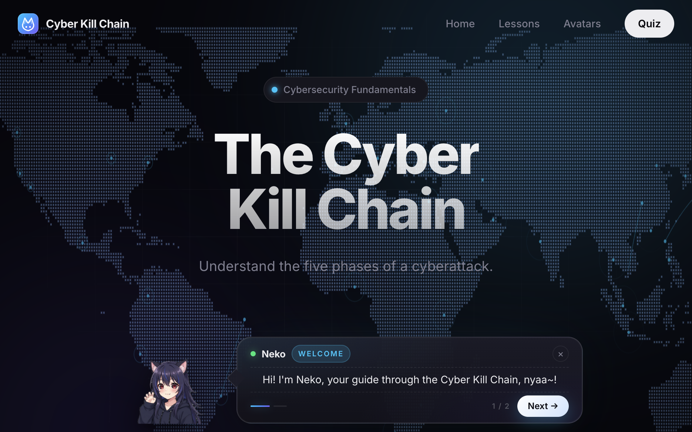
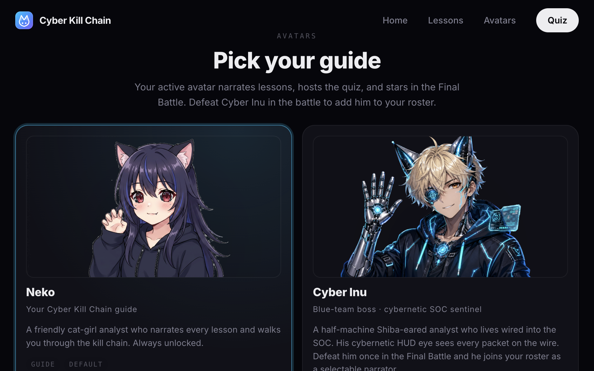

# Cyber Kill Chain · Web Application

COMS 4170W · Final Project by Nicolas Hunt (nh2905@columbia.edu)
An interactive, multi-page Flask web app that
teaches students the five phases of the Cyber Kill Chain through
seven illustrated lessons and a turn-based Final Battle against a
boss-narrator avatar.

**Live at → [https://cyberkillchain.io](https://cyberkillchain.io)**



## Stack

- **Backend:** Flask 3 (Python 3.11+), gunicorn in production
- **Frontend:** HTML, CSS, jQuery 3.7, Bootstrap 5.3, vanilla JS
- **Content:** Data-driven from `data/content.json`
- **Storage:** Single-user JSON files on disk
  - `data/session.json` · current run (events, answers, score)
  - `data/avatars.json` · persistent unlock roster (survives "Start Over")
- **Deployment:** GCP Compute Engine (e2-micro · Ubuntu 24.04) behind
  nginx with a Let's Encrypt cert; gunicorn under systemd

## Routes

| Route | Method | Purpose |
| --- | --- | --- |
| `/` | GET | Home screen with **Begin Learning** button |
| `/start` | POST | Resets the session, redirects to `/learn/1` |
| `/learn/<n>` | GET | Renders lesson *n* (1–7); records a `lesson_enter` event |
| `/learn/<n>/event` | POST | Records an interaction event from the client (scene clicks, etc.) |
| `/quiz/<n>` | GET | Renders challenge *n* of the quiz (currently a single Final Battle) |
| `/quiz/<n>` | POST | Saves the user's submission, advances to the next challenge or to the result page |
| `/quiz/result` | GET | Scores the run and renders the review screen |
| `/avatars` | GET | Roster screen — pick your active narrator, see locked / unlocked avatars |
| `/api/avatars/select` | POST | Set the active avatar (must already be unlocked) |
| `/api/avatars/unlock` | POST | Mark an avatar as unlocked (called by the battle on victory) |

## Lessons

1. The Framework (kill chain overview)
2. Phase 1 · Reconnaissance
3. Phase 2 · Arm & Deliver
4. Phase 3 · Initial Compromise
5. Phase 4 · Escalate Privileges
6. Phase 5 · Exfiltration
7. Case Study · MGM Resorts Breach (2023)

Each lesson page renders an interactive scene from
`templates/partials/scene_*.html` and POSTs every click to
`/learn/<n>/event` so the backend has a complete record of how the
student worked through the material.

## The Final Battle (quiz)

Instead of a multiple-choice quiz, the assessment is a single
turn-based engagement against **Cyber Inu**, a blue-team boss avatar.
Each round, Inu picks a defensive **posture** (Honeypotting, Hunting,
Hardening, Key Rotation, Triaging) and the player picks an offensive
**move** drawn from one of the five kill-chain phases. Each posture
has exactly one move that breaks it — picking it cleanly clears the
phase; picking a weak move spikes Inu's detection meter. Reach the
objective before the IR clock runs out (or the SOC catches you) to
win the engagement.

## Avatars (Pokédex-style unlocks)



Beating Cyber Inu in the Final Battle unlocks him as a selectable
narrator from the **Avatars** page.

## Data model

```
cyberkillchain/
├── app.py                  # Flask app, routes, grader, avatar persistence
├── requirements.txt        # Flask (gunicorn added in prod, not pinned here)
├── README.md
├── data/
│   ├── content.json        # All lesson copy, quiz config, avatar roster
│   ├── session.json        # Runtime: events, quiz answers, score
│   └── avatars.json        # Persistent: { active, unlocked[] }
├── static/
│   ├── css/style.css       # Dark theme + Bootstrap overlay
│   ├── js/site.js          # Shared page-level utilities (jQuery)
│   ├── js/scenes.js        # Interactive scenes per lesson page
│   ├── js/mascot.js        # Avatar narrator (vanilla)
│   ├── js/avatars.js       # Roster / select page logic
│   ├── js/quiz.js          # Quiz shell glue
│   ├── js/battle.js        # Turn-based Final Battle engine
│   ├── js/cyber-bg.js      # Animated background
│   ├── img/                # UI imagery (background, decoration)
│   └── assets/*.png        # Mascot poses (Neko + Inu)
└── templates/
    ├── base.html
    ├── home.html
    ├── learn.html
    ├── quiz.html
    ├── result.html
    ├── avatars.html
    └── partials/
        ├── stepper.html
        ├── quiz_battle.html
        ├── scene_framework.html
        ├── scene_recon.html
        ├── scene_armdeliver.html
        ├── scene_compromise.html
        ├── scene_escalate.html
        ├── scene_exfil.html
        └── scene_casestudy.html
```

## Running locally

```bash
python3 -m venv .venv
source .venv/bin/activate
pip install -r requirements.txt

python app.py
# → Flask is now serving on http://127.0.0.1:5000
```

Visit `http://127.0.0.1:5000`, click **Begin Learning**, and walk
through the lessons. The backend records every page entry, every
lesson-scene click, and every quiz submission into `data/session.json`.

To confirm data is actually being stored server-side, open
`http://127.0.0.1:5000/api/session` at any point.

## Deployment

The live site at [cyberkillchain.io](https://cyberkillchain.io) runs
on a single GCP `e2-micro` Compute Engine VM (Ubuntu 24.04) in
`us-central1`. The serving stack is:

- **gunicorn** (1 sync worker) bound to `127.0.0.1:8000`, run under
  a `systemd` unit so it auto-starts on boot and auto-restarts on
  crash. One worker is intentional: the JSON-file storage has no
  locking, so multiple workers would race.
- **nginx** as the public reverse proxy, terminating TLS on `443`
  and serving `/static/` directly from disk.
- **Let's Encrypt** for the TLS cert, issued and auto-renewed via
  `certbot`'s `certbot.timer` systemd unit.

## Credit

The Cyber Kill Chain framework was developed by Lockheed Martin in
2011. Content here is adapted for educational purposes.
